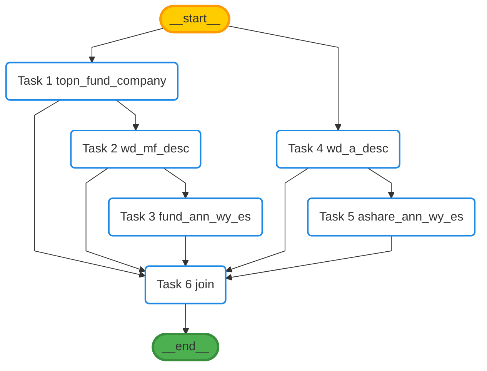
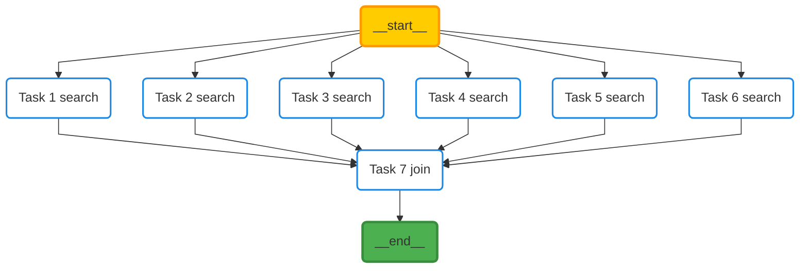
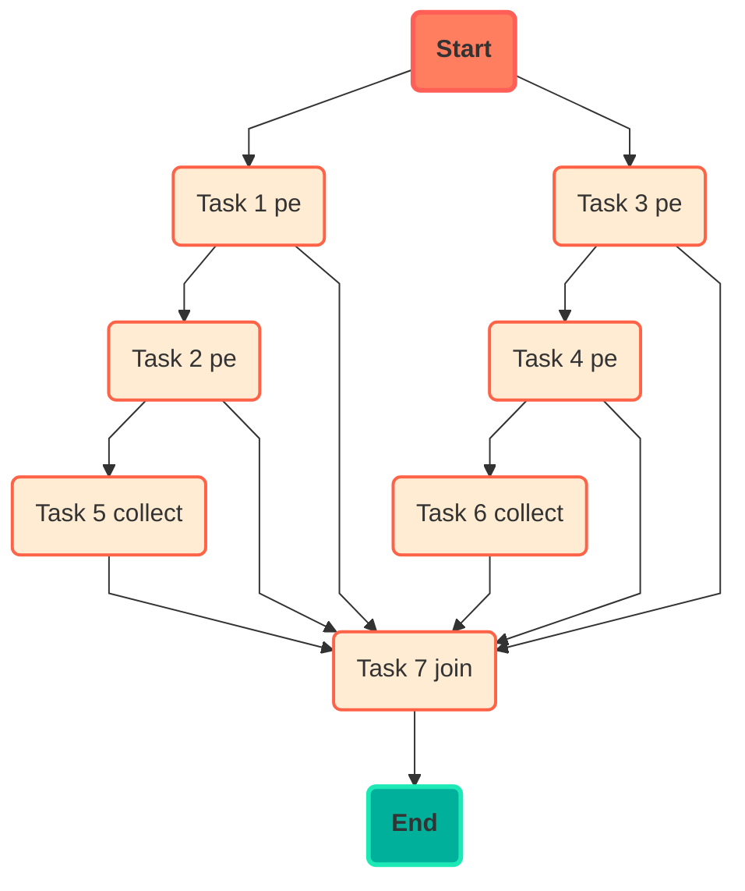

Here's the table of contents:
1. TOC
{:toc}

&emsp;（AI总结）LLMCompiler技术在对话系统、搜索系统、数据处理和智能投研等领域的实际应用。通过智能搜索和数据查询，提升用户体验和数据处理效率；在指标提取和选股中，支持精准数据分析和投资决策。这些应用展示了LLMCompiler的技术优势和实际价值。

&emsp;本文仅提供LLMCompiler技术的实现效果展示，以及部分实现代码可供参考。

## 对话系统-产品数据查询
### DAG示例

- 易方达中短债成立以来收益率、累计净值情况；易方达新兴产业最近三年收益和单位净值


## 搜索系统-智能搜索

&emsp;智能搜索场景中规划器运行后，通过DAG调用各个接口结果后马上返回给用户，整个过程只调用一次大模型接口；整体的响应时间取决于一次LLM调用的响应时间和各个接口最大并发执行响应时间。

### DAG示例

- 头部10家公募近半年发布的reits产品合同和冰川网络今年八月份的财务报告



### 示例实现

```python
# 使用`planer_invoke_output`仅获取工具调用结果，而不执行内容分析总结`joiner`节点的运行
results = RunLLMCompiler(
        chat=ChatRequest(message=search_query),
        tools=tool_list,
        llm=ChatHarvestAI(model=conf.MODEL, temperature=0, max_retries=3, model_kwargs={'stream': False}),
        few_shot=FewShot([conf.FEW_SHOT_CFI_V1], conf.FEW_SHOT_TYPE_V1, 10)
    ).planer_invoke_output()
```

## 数据处理-指标提取

### DAG示例

- A房屋和B房屋在2023~2025年的租金是多少



### 示例实现

- 入口函数

```python
import os
import logging
import random

from jsdata.llm_langchain import ChatHarvestAI
from llmcompiler.chat.run import RunLLMCompiler
from llmcompiler.few_shot.few_shot import DefaultBaseFewShot, BaseFewShot
from llmcompiler.result.chat import ChatRequest
from llmcompiler.tools.basic import Tools

FEW1 = """
<问题>
A房屋在2023~2024年的租金是多少
<执行计划>
1. 使用`search`工具获取A房屋在2023年的租金
2. 使用`search`工具获取A房屋在2024年的租金
"""


def get_few_shot() -> BaseFewShot:
    few_shot = DefaultBaseFewShot()
    few_shot.add(id=str(123), question=FEW1, update_time="2024-11-11 01-01-01")
    return few_shot


custom_prompts = {
    "JOINER_RESPONSE_HUMAN_TEMPLATE": """请基于用户问题，和给出的数据信息，有逻辑并且严谨的生成用户需要的`Final Answer`。
生成`Final Answer`时需要重点检查生成的数值类内容是否正确，同时需要保证回复的数据信息是用户问题所涉及的。
`Final Answer`的内容可以是几句精简的总结性内容但是需要保证完整的回复用户问题。
`Final Answer`中如果需要进行数值类分析，仔细理解字段信息后可以尝试分析最大值、最小值、以及数据变化趋势等信息。
`Final Answer`请不要带有任何格式和大段的数字类内容。
请记住最终返回给用户的响应格式应该是`RESPONSE FORMAT INSTRUCTIONS`可选项中的一种，请按照要求输出。

当结果是`_finish_`时，请按照下面的格式将结果填入`_finish_`中，格式如下：

[
 {{
    "指标名称":...,
    "指标值":...
 }}
]

**用户问题**
{question}

Let’s think step by step!"""
}


def filter_stock(query: str):
    query += f'{query}'
    chat = ChatRequest(message=query)
    # 加载TOOLS
    path = os.path.join(os.path.dirname(os.path.abspath(__file__)), 'tools')
    tools = Tools.load_tools(path)
    # 演示批量加载`tools`后如何给`tool`参数重新赋值
    tools = [type(tool)(path="s3://...", test="test") for tool in tools]

    # 初始化LLM
    llm = ChatHarvestAI(model="gpt-4o", temperature=0, max_retries=3)
    llm_compiler = RunLLMCompiler(chat=chat, tools=tools, llm=llm, few_shot=get_few_shot(),
                                  custom_prompts=custom_prompts)

    # result = llm_compiler.planer_invoke_output()
    result = llm_compiler()
    return result


if __name__ == '__main__':
    from dotenv import load_dotenv

    load_dotenv()
    # Configure logging
    logging.basicConfig(level=logging.INFO, format='%(asctime)s - %(levelname)s - %(message)s')
    query = "A房屋和B房屋在2023~2025年的租金是多少"
    print(filter_stock(query))

# 输出结果
# {
#     "_thought_": "我已经获得了A房屋和B房屋在2023年至2025年的租金信息，可以总结出最终答案。",
#     "_finish_": [{
#             "指标名称": "A房屋2023年租金",
#             "指标值": 0.2543497200498416
#         }, {
#             "指标名称": "A房屋2024年租金",
#             "指标值": 0.21585695508713343
#         }, {
#             "指标名称": "A房屋2025年租金",
#             "指标值": 0.01981390801092242
#         }, {
#             "指标名称": "B房屋2023年租金",
#             "指标值": 0.9560805412684173
#         }, {
#             "指标名称": "B房屋2024年租金",
#             "指标值": 0.367723174253609
#         }, {
#             "指标名称": "B房屋2025年租金",
#             "指标值": 0.49962108675051187
#         }
#     ]
# }
```

- TOOL实现

```python
# tools/search.py
import logging
import random

from langchain_core.tools import BaseTool
from pydantic import BaseModel, Field
from typing import Type, Any

from llmcompiler.tools.configure.pydantic_oper import field_descriptions_join
from llmcompiler.tools.generic.action_output import ActionOutput, ActionOutputError
from llmcompiler.tools.generic.render_description import render_text_description

logger = logging.getLogger(__name__)


class InputSchema(BaseModel):
    query: str = Field(description="拆分后的子问题")


class Search(BaseTool):
    name = "search"
    description = render_text_description(
        "功能：搜索子问题相关的文本段落。"
        f"输入参数: {field_descriptions_join(InputSchema)}"
        f"返回值: 子问题相关段落。"
    )
    args_schema: Type[BaseModel] = InputSchema

    path: str = None

    def _run(self, **kwargs: Any) -> ActionOutput:
        try:
            result = f"租金是 {random.random()} 元~"
            return ActionOutput(any=result)
        except Exception as e:
            logger.error(str(e))
        return ActionOutputError()
```

## 智能投研-指标选股

- 2023年底pettm在1-3之间股票或pb在4~6之间的股票

### DAG示例


### 规划器日志
```
================================ Planer Compiler ================================
pe,pe,pb,pb,collect,collect
---
idx: 1
tool: pe
args: {'time': '2023-12-31', 'value': 1, 'operator': '>='}
dependencies: []
thought: None
---
---
idx: 2
tool: pe
args: {'code': '${1}.code', 'time': '2023-12-31', 'value': 3, 'operator': '<='}
args<Analyzed>: {'code': ['000001', '000002', '600000', '600519', '002415'], 'time': '2023-12-31', 'value': 3, 'operator': '<='}
dependencies: [1]
thought: None
---
---
idx: 3
tool: pb
args: {'time': '2023-12-31', 'value': 4, 'operator': '>='}
dependencies: []
thought: None
---
---
idx: 4
tool: pb
args: {'code': '${3}.code', 'time': '2023-12-31', 'value': 6, 'operator': '<='}
args<Analyzed>: {'code': ['000001', '000002', '600000', '600519', '002415'], 'time': '2023-12-31', 'value': 6, 'operator': '<='}
dependencies: [3]
thought: None
---
---
idx: 5
tool: collect
args: {'query': '2023年底pettm在1-3之间股票', 'code': '${2}.code'}
args<Analyzed>: {'query': '2023年底pettm在1-3之间股票', 'code': ['000001', '000002', '600000', '600519', '002415']}
dependencies: [2]
thought: None
---
---
idx: 6
tool: collect
args: {'query': 'pb在4~6之间的股票', 'code': '${4}.code'}
args<Analyzed>: {'query': 'pb在4~6之间的股票', 'code': ['000001', '000002', '600000', '600519', '002415']}
dependencies: [4]
thought: None
---
---
idx: 7
tool: join
args: ()
dependencies: [1, 2, 3, 4, 5, 6]
thought: None
---
```

### 示例实现

- 主函数入口

```python
import os
import logging
from jsdata.llm_langchain import ChatHarvestAI
from llmcompiler.chat.run import RunLLMCompiler
from llmcompiler.few_shot.few_shot import BaseFewShot, DefaultBaseFewShot
from llmcompiler.result.chat import ChatRequest
from llmcompiler.tools.basic import Tools

FEW1 = """
<问题>
2022年六月pettm在1-3之间股票有哪些
<执行计划>
1. 使用`pe`工具过滤相关股票，参数为：time=2022-06-01, value=1, operator='>='
2. 在上次过滤的基础上继续使用`pe`工具过滤相关股票，参数为：{'code': '${1}.code', 'time': '2022-06-01', 'value': 3, 'operator': '<='}
"""


def get_few_shot() -> BaseFewShot:
    few_shot = DefaultBaseFewShot()
    few_shot.add(id=str(123), question=FEW1, update_time="2024-11-11 01-01-01")
    return few_shot


def filter_stock(query: str):
    query += f'{query}。最后请调用`collect`工具收集各个子问题最终结果。'
    chat = ChatRequest(message=query)
    # 加载TOOLS
    path = os.path.join(os.path.dirname(os.path.abspath(__file__)), 'tools')
    tools = Tools.load_tools(path)
    # 初始化LLM
    llm = ChatHarvestAI(model="gpt-4o", temperature=0, max_retries=3)
    llm_compiler = RunLLMCompiler(chat=chat, tools=tools, llm=llm, few_shot=get_few_shot())
    result = llm_compiler.planer_invoke_output()
    return result


if __name__ == '__main__':
    from dotenv import load_dotenv

    load_dotenv()
    # Configure logging
    logging.basicConfig(level=logging.INFO, format='%(asctime)s - %(levelname)s - %(message)s')

    # query = "2023年底pettm在1-3之间股票"
    query = "2023年底pettm在1-3之间股票或pb在4~6之间的股票"
    # query = "2023年底pettm在1-3之间且当前的pb大于7的美国大选概念股"
    # query = "2023年底pettm在1-3之间且当前的pb大于7的美国大选概念股或科技股"
    # query = "2023年底pettm在1-3之间或当前的pb大于7的美国大选概念股或科技股"
    print(filter_stock(query))
```

- TOOL-概念股过滤
```python
import logging

from pydantic import BaseModel
from typing import List, Type, Any

from llmcompiler.tools.basic import CompilerBaseTool
from llmcompiler.tools.configure.pydantic_oper import field_descriptions_join
from llmcompiler.tools.generic.action_output import ActionOutput, ActionOutputError
from llmcompiler.tools.generic.render_description import render_text_description
from src.stock_db.filter_stock.tools.schema import IndicatorInputSchema, IndicatorOutputSchema, \
    get_demo_stocks

logger = logging.getLogger(__name__)


class Concept(CompilerBaseTool):
    name = "concept"
    description = render_text_description(
        "功能：使用`概念`过滤股票列表。"
        f"输入参数: {field_descriptions_join(IndicatorInputSchema)}"
        f"返回值: {field_descriptions_join(IndicatorOutputSchema)}"
    )
    args_schema: Type[BaseModel] = IndicatorInputSchema

    output_model: Type[BaseModel] = IndicatorOutputSchema
    dag_flow_kwargs: List[str] = ['code']

    def _run(self, **kwargs: Any) -> ActionOutput:
        try:
            results = get_demo_stocks()
            return ActionOutput(any=results, dag_kwargs=self.flow(results))
        except Exception as e:
            logger.error(str(e))
        return ActionOutputError()
```

- TOOL-PE过滤
```python
import logging

from pydantic import BaseModel
from typing import List, Type, Any

from llmcompiler.tools.basic import CompilerBaseTool
from llmcompiler.tools.configure.pydantic_oper import field_descriptions_join
from llmcompiler.tools.generic.action_output import ActionOutput, ActionOutputError
from llmcompiler.tools.generic.render_description import render_text_description
from src.stock_db.filter_stock.tools.schema import IndicatorInputSchema, IndicatorOutputSchema, \
    get_demo_stocks

logger = logging.getLogger(__name__)


class PE(CompilerBaseTool):
    # PE 比率，也称为市盈率，是衡量公司股价与其每股收益之间关系的指标。
    name = "pe"
    description = render_text_description(
        "功能：使用`市盈率`指标过滤股票列表。"
        f"输入参数: {field_descriptions_join(IndicatorInputSchema)}"
        f"返回值: {field_descriptions_join(IndicatorOutputSchema)}"
    )
    args_schema: Type[BaseModel] = IndicatorInputSchema

    output_model: Type[BaseModel] = IndicatorOutputSchema
    dag_flow_kwargs: List[str] = ['code']

    def _run(self, **kwargs: Any) -> ActionOutput:
        try:
            results = get_demo_stocks()
            return ActionOutput(any=results, dag_kwargs=self.flow(results))
        except Exception as e:
            logger.error(str(e))
        return ActionOutputError()
```

- TOOL-PB过滤
```python
import logging

from pydantic import BaseModel
from typing import List, Type, Any

from llmcompiler.tools.basic import CompilerBaseTool
from llmcompiler.tools.configure.pydantic_oper import field_descriptions_join
from llmcompiler.tools.generic.action_output import ActionOutput, ActionOutputError
from llmcompiler.tools.generic.render_description import render_text_description
from src.stock_db.filter_stock.tools.schema import IndicatorInputSchema, IndicatorOutputSchema, \
    get_demo_stocks

logger = logging.getLogger(__name__)


class PB(CompilerBaseTool):
    # PB 比率，也称为市净率，是衡量公司市值与其账面价值之间关系的指标。
    name = "pb"
    description = render_text_description(
        "功能：使用`市净率`指标过滤股票列表。"
        f"输入参数: {field_descriptions_join(IndicatorInputSchema)}"
        f"返回值: {field_descriptions_join(IndicatorOutputSchema)}"
    )
    args_schema: Type[BaseModel] = IndicatorInputSchema

    output_model: Type[BaseModel] = IndicatorOutputSchema
    dag_flow_kwargs: List[str] = ['code']

    def _run(self, **kwargs: Any) -> ActionOutput:
        try:
            results = get_demo_stocks()
            return ActionOutput(any=results, dag_kwargs=self.flow(results))
        except Exception as e:
            logger.error(str(e))
        return ActionOutputError()
```

- TOOL-结果集处理
```python
import logging

from langchain_core.tools import BaseTool
from llmcompiler.tools.configure.pydantic_oper import field_descriptions_join
from pydantic import BaseModel
from typing import Type

from llmcompiler.tools.generic.action_output import ActionOutput, ActionOutputError
from llmcompiler.tools.generic.render_description import render_text_description

from src.stock_db.filter_stock.tools.schema import CollectInputSchema, CollectOutputSchema

logger = logging.getLogger(__name__)


class Collect(BaseTool):
    """主要用于收集最终结果，方便区分自然语言描述中的`AND`、`OR`逻辑"""
    name = "collect"
    description = render_text_description(
        "功能：子问题相关的最终筛选结果，使用过滤筛选工具后最后必须要使用该工具收集结果。"
        f"输入参数: {field_descriptions_join(CollectInputSchema)}"
        f"返回值: {field_descriptions_join(CollectOutputSchema)}"
    )
    args_schema: Type[BaseModel] = CollectInputSchema

    def _run(self, **kwargs) -> ActionOutput:
        """Use the tool."""
        try:
            # 收集子问题结果
            return ActionOutput(any=kwargs)
        except Exception as e:
            logger.error(str(e))
        return ActionOutputError()
```

- SCHEMA定义
```python
from enum import Enum
from typing import Optional, Union, List, Any

from pydantic import BaseModel, Field


# =================================指标过滤输入与输出=================================
class Operator(Enum):
    GREATER_THAN = '>'
    EQUAL = '='
    LESS_THAN = '<'
    LESS_THAN_OR_EQUAL = '<='
    GREATER_THAN_OR_EQUAL = '>='
    NOT_EQUAL = '!='
    MAX = 'MAX'
    MIN = 'MIN'


class IndicatorInputSchema(BaseModel):
    code: Optional[Any] = Field(default=None, description="是否使用上次过滤的结果继续筛选，例如输入为`$1`、`$2`...")
    # 可考虑支持时间范围过滤
    time: str = Field(description="过滤时间，格式：YYYY-MM-DD")
    value: Union[int, float] = Field(description="过滤的指标数值")
    operator: Operator = Field(
        description="过滤条件的操作符，举类定义了常见的比较操作符，包括大于(>), 等于(=), 小于(<), 小于等于(<=), 大于等于(>=) 和不等于(!=)")


class IndicatorOutputSchema(BaseModel):
    code: str = Field(description="股票代码")


def get_demo_stocks() -> List[IndicatorOutputSchema]:
    # 创建一些示例股票数据
    demo_stocks = [
        IndicatorOutputSchema(code="000001"),
        IndicatorOutputSchema(code="000002"),
        IndicatorOutputSchema(code="600000"),
        IndicatorOutputSchema(code="600519"),
        IndicatorOutputSchema(code="002415"),
    ]
    return demo_stocks


# =================================结果聚合输入与输出=================================
class CollectInputSchema(BaseModel):
    query: str = Field(description="子问题")
    code: Optional[Any] = Field(default=None,
                                description="需要提供给用户的该子问题最终的筛选结果，例如输入为['$1','$2',...]")


class CollectOutputSchema(BaseModel):
    code: str = Field(description="股票代码")
```
## LLMCompiler SDK 链接
[LLMCompiler](https://github.com/crazyyanchao/llmcompiler)
